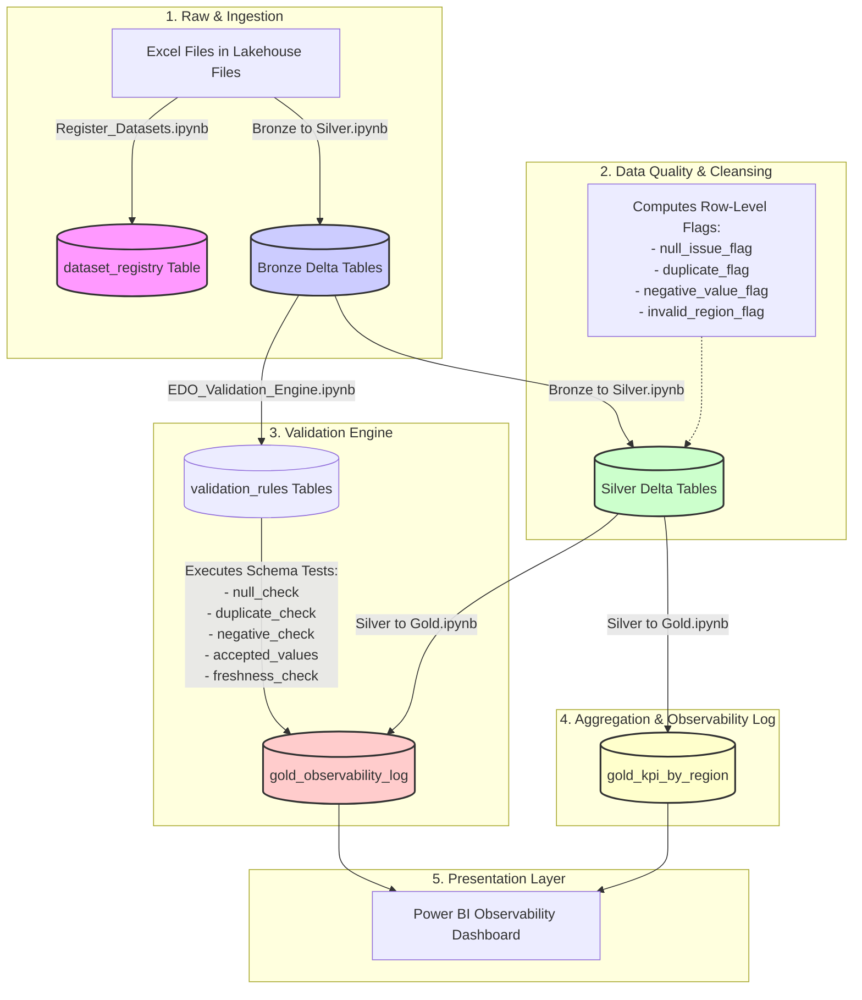
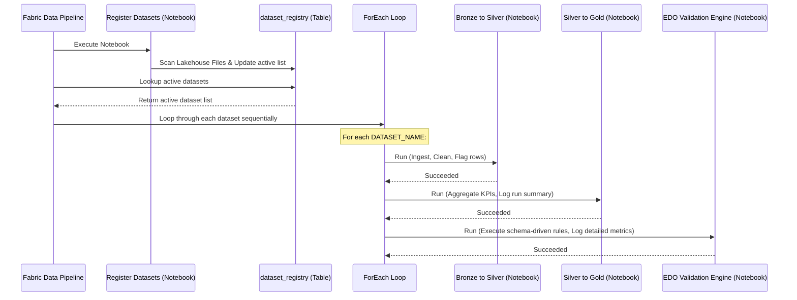

# 🔍 Enterprise Data Observability (EDO) Accelerator

<p align="center">
  
  
  
  
</p>


[](https://azure.microsoft.com/en-us/products/microsoft-fabric/)
[](https://spark.apache.org/)
[](https://delta.io/)
[](https://powerbi.microsoft.com/)

A metadata-driven, configuration-first data quality and observability engine built entirely on **Microsoft Fabric**. This accelerator automates the monitoring, cleaning, and validation of enterprise datasets using a universal medallion lakehouse pattern (Bronze $\rightarrow$ Silver $\rightarrow$ Gold) with **zero code changes** required to onboard new datasets.

Designed and developed by **Arghyadeep Paul** (*Associate Technical Consultant – Data Analytics & AI*), certified Fabric Analytics Engineer Associate and Power BI Data Analyst Associate.

---

## 🛠️ 1. What This Accelerator Does

The EDO Accelerator is designed to solve data quality decay and observability blindspots in enterprise pipelines. By decoupling the validation engine from the data structure, the engine is **universal by design**: the validation logic, severity scoring, and Gold layer logs remain static, while only the dataset registry and rule configurations change per deployment.

### Key Capabilities

*   **Zero-Code Dataset Ingestion**: Automatically detects, registers, and normalizes tabular data (Excel/CSV) from Lakehouse Files into structured Bronze Delta tables.
*   **Schema-Driven Validation Engine**: Automatically generates dataset-specific validation rules (null, duplicate, negative value, accepted values, and freshness checks) by inspecting the dataset's schema.
*   **AI-Powered Severity Scoring**: Computes a dynamic dataset-level status (`HEALTHY`, `MEDIUM`, `HIGH`, `CRITICAL`) based on statistical check failure percentages.
*   **Historical Audit Tracking**: Logs timestamped execution metadata, row-level severity states, and column-level validation details to an append-only Gold log table.
*   **Downstream Power BI Observability**: Instantly visualizes pipeline health, severity trends, and failing columns through a custom Power BI reporting dashboard.

---

## 🏗️ 2. Medallion Observability Architecture

The accelerator follows a Medallion architecture optimized for pipeline observability:



### Layer Details

| Medallion Layer | Table Name | Purpose & Contents |
| :--- | :--- | :--- |
| **Config** | `dataset_registry` | Holds the metadata of registered datasets, their category, and active status. |
| **Config** | `validation_rules_{dataset}` | Stores auto-generated column validation rules, check types, and thresholds. |
| **Bronze** | `bronze_{dataset}` | Raw ingested data in Delta format; column names normalized (lowercase, replaced spaces with `_`). |
| **Silver** | `silver_{dataset}` | Cleaned records with missing values filled dynamically by data type, invalid rows filtered, and row-level quality flags appended. |
| **Gold** | `gold_kpi_by_region` | Grouped business KPIs aggregated by region or the primary string dimension, combined with overall run quality. |
| **Gold** | `gold_observability_log` | Central append-only audit trail logging timestamped rules evaluations, failure rates, target tables, and overall severities. |

---

## ⚙️ 3. Microsoft Fabric Pipeline Orchestration

The EDO Accelerator is fully orchestrated using a Microsoft Fabric Data Pipeline. The pipeline enables automated, end-to-end execution across multiple datasets:



---

## 📓 4. Notebook Components

The accelerator consists of 4 main notebooks built with PySpark and SQL:

### 1. `Register_Datasets.ipynb`
*   **Role**: Initializes the pipeline's registry.
*   **Logic**: Scans the Lakehouse `Files` folder for `.xlsx` or `.csv` files. Dynamically writes metadata (dataset name, auto-category, active flag) into `dataset_registry`.

### 2. `Bronze to Silver.ipynb`
*   **Role**: Ingests raw data, applies basic type validations, cleans values, and scores row-level severity.
*   **Key Functions**:
    *   *Dynamic Null Handling*: Appends `null_issue_flag` = `1` if any column contains a null.
    *   *Primary Key Validation*: Filters out records where the primary key column (first column) is null.
    *   *Dynamic Type-based Filling*: Fills missing string values with `"UNKNOWN"` and missing numeric values with `0.0`.
    *   *Duplicate Detection*: Groups by the primary key to identify and flag duplicates (`duplicate_flag` = `1`).
    *   *Negative Value Detection*: Automatically checks all numeric columns for negative values and flags them.
    *   *Custom Validations*: Checks string columns like `region` against allowed value lists.
    *   *Row Severity Metric*: Assigns a row-level classification:
        $$\text{flags} \ge 3 \implies \text{CRITICAL}$$
        $$\text{flags} = 2 \implies \text{HIGH}$$
        $$\text{flags} = 1 \implies \text{MEDIUM}$$
        $$\text{flags} = 0 \implies \text{HEALTHY}$$

### 3. `Silver to Gold.ipynb`
*   **Role**: Groups, aggregates, and builds reporting KPIs.
*   **Key Functions**:
    *   Identifies group columns (e.g. `region`) dynamically.
    *   Calculates overall dataset-level run severity based on the percentage of flagged (unhealthy) rows.
    *   Performs dynamic sums and averages for numeric columns.
    *   Aggregates counts of each row-severity status and logs the run metadata into `gold_observability_log`.

### 4. `EDO_Validation_Engine.ipynb`
*   **Role**: Schema-driven data quality validation engine.
*   **Key Functions**:
    *   *Rule Auto-Generation*: Auto-generates standard rules for every column based on data type (e.g., `null_check` on all, `negative_check` on numbers, `duplicate_check` on ID, `freshness_check` on date/time fields) and writes to `validation_rules_{dataset}`.
    *   *Rule Evaluation*: Loops through rules to execute Python-based evaluations on the Bronze table.
    *   *AI Severity Scoring*: Scores dataset-level run status based on the percentage of rules that failed:
        $$\text{fail\_pct} \ge 50\% \implies \text{CRITICAL}$$
        $$25\% \le \text{fail\_pct} < 50\% \implies \text{HIGH}$$
        $$0\% < \text{fail\_pct} < 25\% \implies \text{MEDIUM}$$
        $$\text{fail\_pct} = 0\% \implies \text{HEALTHY}$$
    *   *Observability Log*: Appends rule evaluation outcomes (`PASS`, `FAIL`, `SKIPPED`) and status details to `gold_observability_log`.

---

## 💻 5. Core PySpark Ingestion & Validation Logic

The EDO Accelerator runs dynamic PySpark processing inside Microsoft Fabric Synapse Spark pools. Below are the key snippets showcasing the core logic of the data quality engine.

### Ingestion & Dynamic Null Flagging
In `Bronze to Silver.ipynb`, the engine scans all columns dynamically to assign a row-level null flag and fills missing values depending on their data type:

```python
# Create a null issue flag if any column in the row is null
all_cols = silver_df.columns
silver_df = silver_df.withColumn(
    "null_issue_flag",
    F.when(
        F.greatest(*[F.col(c).isNull().cast("int") for c in all_cols]) == 1, 1
    ).otherwise(0)
)

# Fill missing values dynamically based on column types
fill_str = {c: "UNKNOWN" for c, t in silver_df.dtypes if t == "string"}
fill_num = {c: 0.0 for c, t in silver_df.dtypes if t in ("double", "float", "int", "bigint", "long")}
silver_df = silver_df.fillna(fill_str).fillna(fill_num)
```

### Dynamic Duplicate & Negative Value Detection
The engine determines duplicates using the first column as the primary key and automatically scans all numeric columns for negative values:

```python
# Flag duplicate records based on the primary key (first column)
first_col = all_cols[0]
dup_counts = silver_df.groupBy(first_col).count().withColumnRenamed("count", "_dup_count")
silver_df  = silver_df.join(dup_counts, on=first_col, how="left")
silver_df  = silver_df.withColumn(
    "duplicate_flag", F.when(F.col("_dup_count") > 1, 1).otherwise(0)
).drop("_dup_count")

# Scan all numeric columns to identify negative values
numeric_cols = [c for c, t in silver_df.dtypes if t in ("double", "float", "int", "bigint", "long")
                and c not in ("duplicate_flag", "null_issue_flag")]
if numeric_cols:
    neg_flags = [F.when(F.col(c) < 0, 1).otherwise(0) for c in numeric_cols]
    silver_df = silver_df.withColumn(
        "negative_value_flag",
        F.when(F.greatest(*neg_flags) == 1, 1).otherwise(0)
        if len(neg_flags) >= 2 else neg_flags[0]
    )
```

### Dynamic Row Severity Scoring
Row-level severities are scored based on the sum of all validation flags:

```python
flag_sum = (F.col("null_issue_flag") + F.col("duplicate_flag") +
            F.col("negative_value_flag") + F.col("invalid_region_flag"))

silver_df = silver_df.withColumn(
    "row_severity",
    F.when(flag_sum >= 3, "CRITICAL")
     .when(flag_sum == 2, "HIGH")
     .when(flag_sum == 1, "MEDIUM")
     .otherwise("HEALTHY")
)
```

### Rules Auto-Generation
In `EDO_Validation_Engine.ipynb`, validation rules are dynamically compiled based on the Bronze table's column names and schemas:

```python
auto_rules = []
rule_num = 1

for col, dtype in zip(bronze_df.columns, bronze_df.dtypes):
    # All columns get a null check
    auto_rules.append({
        "rule_id": f"R{rule_num:03d}",
        "column_name": col,
        "validation_type": "null_check",
        "threshold": "0"
    })
    rule_num += 1
    
    # Numeric columns get a negative check
    if dtype in ["int64", "float64"]:
        auto_rules.append({
            "rule_id": f"R{rule_num:03d}",
            "column_name": col,
            "validation_type": "negative_check",
            "threshold": "0"
        })
        rule_num += 1
```

---

## 📊 6. Validation Check Types & Rules

| Validation Type | What It Checks | Threshold Format | Example |
| :--- | :--- | :--- | :--- |
| **`null_check`** | Percentage of null/blank values in a column. | Numeric (max % allowed) | `"0"` = zero nulls permitted |
| **`negative_check`** | Count of values below zero in numeric columns. | Numeric (always `0`) | `"0"` = no negatives permitted |
| **`duplicate_check`** | Percentage of duplicate values in the primary key column. | Numeric (max % allowed) | `"0.1"` = up to 0.1% duplicates OK |
| **`accepted_values`** | Checks if values fall outside a predefined whitelist. | Python list as string | `"['APAC','EMEA','NA','LATAM']"` |
| **`freshness_check`** | Checks the age of the most recent record. | Hours as string | `"720 hrs"` = fail if latest record > 720 hrs old |

---

## 🚀 7. How to Onboard a New Dataset

For a complete workspace setup, notebook import, and pipeline orchestration guide, refer to the step-by-step **[Fabric Deployment Guide](Fabric_Deployment_Guide.md)**.

To point the accelerator at a new dataset once the pipeline is configured:

1.  **Upload the file**: Copy the Excel or CSV dataset to the Fabric Lakehouse `Files` folder.
2.  **Run Registry**: Run `Register_Datasets.ipynb` (or execute the Fabric Data Pipeline) to register the file.
3.  **Deploy Configs (Optional)**: If you want to customize validation thresholds:
    *   Open `AI_Sales_Accelerator` notebook.
    *   In **Cell 1**, set `DATASET_NAME = "Your_New_Dataset_Name"` (without extension).
    *   In **Cell 3**, define specific rules and thresholds for your columns.
4.  **Execute**: Run all cells. The engine will dynamically build the Bronze, Silver, and validation rules tables and append the metrics to the Gold observability log.
5.  **Visualize**: Refresh your Power BI dashboard to view the new dataset's quality trends immediately.

---

## 📂 8. Project Directory Structure

```
├── EDO Accelerator/
│   ├── Bronze to Silver.ipynb                      # Cleans, flags, and creates Silver Delta tables
│   ├── Silver to Gold.ipynb                        # Aggregates KPIs and writes Gold logs
│   ├── EDO_Validation_Engine.ipynb                 # Auto-generates rules and evaluates Bronze quality
│   ├── Register_Datasets.ipynb                     # Scans Files and updates dataset_registry
│   ├── Customer_Master_Data.xlsx                   # Sample dataset 1 (Customers)
│   ├── Global_Climate_Records.xlsx                 # Sample dataset 2 (Climate data)
│   ├── Retail_Observability_Intelligence.xlsx      # Sample dataset 3 (Sales & operations data)
│   ├── EDO Observability Dashboard v2.pbix         # Power BI Dashboard file
│   ├── EDO Observability Dashboard v2.pdf          # Power BI Dashboard preview PDF
│   ├── EDO_Accelerator_Documentation.pdf           # Technical Guide & Reference PDF
│   ├── EDO_Accelerator_HowTo_Guide.docx            # Step-by-step deployment guide
│   ├── EDO_Accelerator_Deck.pptx                   # Project Presentation Deck
│   ├── EDO_Accelerator_Walkthrough.pptx            # Product Walkthrough PPT
│   ├── EDO_Observability_Pipeline/                 # Fabric Data Pipeline definition
│   │   ├── EDO_Observability_Pipeline.json         # Pipeline Deployment JSON
│   │   └── manifest.json                           # Fabric Pipeline Metadata
│   ├── EDO_Observability_Pipeline_Activity runs.csv # Sample pipeline activity history
│   ├── Screenshot 2026-07-01 171657.png            # Dashboard UI Screenshot 1
│   ├── Screenshot 2026-07-01 171827.png            # Pipeline Run Screenshot 2
│   ├── Fabric_Deployment_Guide.md                  # Detailed step-by-step deployment guide
│   ├── .gitignore                                  # Git exclusion configuration
│   └── LICENSE                                     # MIT License
```

---

## 🤝 9. Contributing & Open-Source Help Needed!

This accelerator is open-source and ready for production, but we are looking for contributions to add support for even more enterprise scenarios!

### 💡 Up-For-Grabs Features:
*   [ ] **Webhook Alerts**: Design notebook extensions that send immediate Teams or Slack notifications when the pipeline severity rises to `CRITICAL`.
*   [ ] **SQL/DW Sources**: Extend `Register_Datasets.ipynb` to dynamically onboard Azure SQL Databases and Fabric Data Warehouses as ingestion sources (instead of Excel only).
*   [ ] **Anomaly Scoring Models**: Add dynamic machine learning anomaly detection notebooks to automatically score data deviations in the Silver layer.

**How to contribute**:
1. Fork the repo and clone locally.
2. Implement your features, test them against your Fabric capacity, and update the directory structure.
3. Open a Pull Request detailing your enhancements!

---

## 📄 10. License

This project is licensed under the MIT License - see the [LICENSE](LICENSE) file for details.
